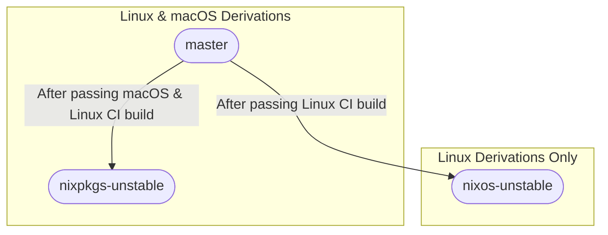
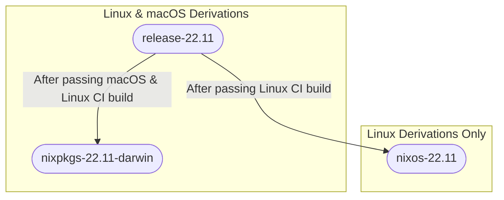

# Nix Concepts

## Nixpkgs

The [NixOS/nixpkgs](https://github.com/NixOS/nixpkgs) repository is a monorepo
of all derivations offered by Nix. It offers a few branches, detailed below.

### `master`

The `master` branch is the upstream source of truth. It contains the bleeding-
edge updates to `nixpkgs` as they are merged from Nix contributors. As such, it
is not recommended to use the master branch in your configuration. This branch
contains derivations for both Linux *and* macOS.

### `nixpkgs-unstable`

The `nixpkgs-unstable` branch is updated with all changes made to the `master`
branch that pass an automated build/test process. Like `master`, this branch
contains derivations for both Linux *and* macOS.

### `nixos-unstable`

The `nixos-unstable` branch is also updated from the `master` branch, but only
contains derivations made for Linux specifically. It has a separate automated
build/test process.

### `nixpkgs-22.11-darwin`

The `nixpkgs-22.11-darwin` branch is updated from the `release-22.11` branch,
and contains stable derivations specifically for macOS.

### `nixos-22.11`

The `nixos-22.11` branch is updated from the `release-22.11` branch,
and contains stable derivations specifically for NixOS.

### Unstable Branches Diagram

### Stable Branches Diagram

